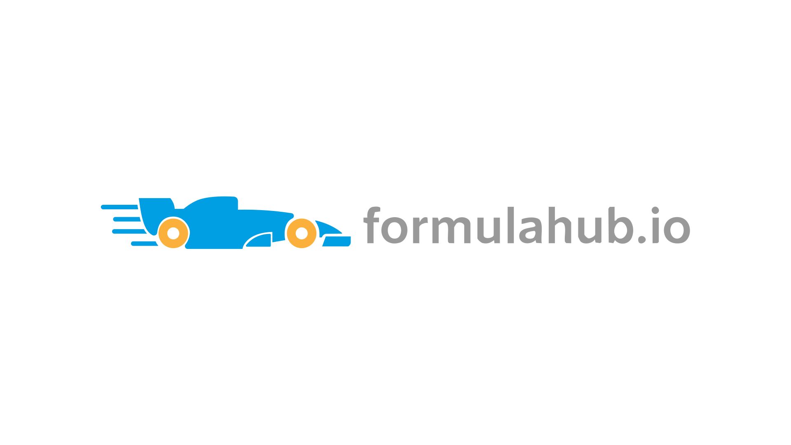

<div style="text-align: center;">
  
</div>

# FormulaHub.io

FormulaHub — a **CSV-first** platform focused on tabular racing datasets and tools for motorsport data analysis. Developed by DiversoLab / FormulaHub.

## Overview

FormulaHub is a specialized repository platform for motorsport result and telemetry datasets. It validates, stores, and provides access to structured CSV files containing detailed race information, enabling researchers and analysts to share and discover data from Formula series and other racing categories.

## CSV Structure Requirements

All datasets uploaded to FormulaHub must follow a specific CSV structure. Each CSV file represents a collection of race results, with each row containing information about a single driver in a race.

### Required Columns

Working on it.

### Example CSV

Working on it.

### Validation Rules

Working on it.

##  Features

Working on it.

##  Development

### Prerequisites

- Python 3.8+
- MariaDB/MySQL
- Docker (optional)

### Installation

```bash
# Clone the repository
git clone [https://github.com/Formula-hub1/formula-hub1.git](https://github.com/Formula-hub1/formula-hub1.git)
cd formula-hub1

# Create virtual environment
python3 -m venv venv
source venv/bin/activate
# For Windows use .\venv\Scripts\activate

# 3. Run the installation script
chmod +x scripts/install.sh
scripts/install.sh

# Run development server
flask run
```

### Running with Docker

```bash
# Create .env.docker
cp .env.docker.example .env.docker

# Initialize docker
docker compose -f docker/docker-compose.dev.yml up
```

##  Testing

```bash
# Run all tests
pytest

# Run with coverage
pytest --cov=app
```

##  Contributing

Contributions are welcome! Please read our contributing guidelines before submitting pull requests.

##  Documentation

### Project Documentation

- **[Contributing Guide](.github/contributing.md)** - Complete workflow for contributing to the project
  - Issue templates and management
  - Commit conventions (Conventional Commits)
  - Branch strategy (`main`, `trunk`, `bugfix`, `feature/*`)
  - Merge workflow and versioning
  - Git hooks usage

- **[Issue Templates](.github/ISSUE_TEMPLATE/)** - Standardized templates for:
  -  Bug reports
  -  Feature requests

- **[Git Hooks](.githooks/)** - Automated validation
  - `commit-msg` hook for enforcing commit conventions
  - Installation and usage instructions

### Getting Started

1. Read the [Contributing Guide](.github/contributing.md)
2. Install Git hooks: `pre-commit install` & `pre-commit install ---hook-type commit-msg`
3. Configure commit template: `git config commit.template .gitmessage`
4. Create an issue using our templates
5. Follow the branch and commit workflow

### Branch Strategy

- **main** - Production code
- **trunk** - Development integration
- **bugfix** - Shared bug fixes
- **feature/*** - New features (deleted after merge)
- **document/*** - Documentation updates (deleted after merge)

##  License

This project is developed by DiversoLab / FormulaHub.


